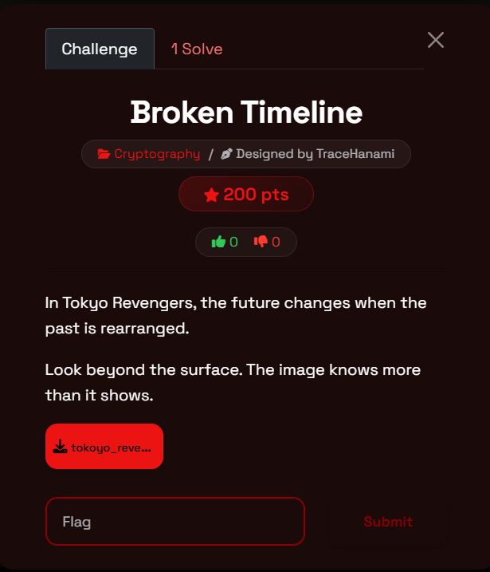
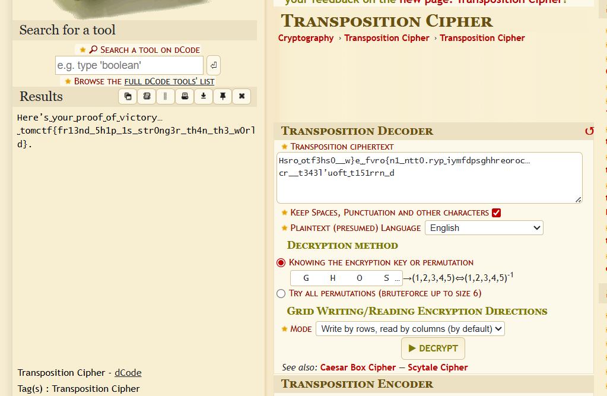

## TomCTF Writeup: Broken Timeline

Welcome back, hackers. Today we’re leaping through time with a challenge inspired by *Tokyo Revengers*. This challenge, **Broken Timeline**, is a masterclass in "hiding in plain sight." It forces you to look away from the center of the action and focus on the structural integrity of the data itself.

## What You'll Learn

- How to spot side-channel data (text hidden in image margins).
- The mechanics of a **Columnar Transposition Cipher**.
- How to use visual clues in a challenge (Steganography) to find a cryptographic **Key**.
- Using **dCode** to automate the "unshuffling" of a broken timeline.

## Tools Used

- **Aperi'Solve / StegSolve**: To inspect image planes and margins.
- **dCode.fr**: For Transposition Cipher decryption.

## Challenge Overview

- **Event**: TomCTF
- **Challenge Name**: Broken Timeline
- **Category**: Cryptography / Steganography
- **Difficulty**: Easy
- **Designer**: TraceHanami

### Description

> In Tokyo Revengers, the future changes when the past is rearranged. Look beyond the surface. The image knows more than it shows.
> 

## Step-by-Step Walkthrough

### Step 1 — Finding the "Ghost" in the Margin

At first glance, it’s a standard manga panel. But if you look at the left-hand margin of the image file, there is a vertical string of seemingly garbled text. When we extract it, we get our ciphertext:

`Hsro_otf3hs0__w]e__fvro{n1_ntt0.ryp_iymfdpsghhreoroc...cr__t3431'uoft_t151rrn_d`

### Step 2 — Identifying the "Rearrangement"

The description mentions the past being "rearranged." In cryptography, rearrangement is a synonym for **Transposition**. Unlike a substitution cipher (like Caesar), a transposition cipher keeps the original letters but shuffles their positions.

### Step 3 — Hunting for the Key

A transposition cipher usually requires a **Keyword** to determine how many columns the text was split into. Looking closely at the manga panels:

1. The character is holding a key.
2. The key clearly has the word **"GHOST"** engraved on it.

This isn't just flavor text—`GHOST` is our encryption key.

### Step 4 — Restoring the Timeline

We head over to **dCode.fr** and select the Transposition Cipher tool.

- **Ciphertext**: We paste the string found in the margin.
- **Key**: We enter `GHOST`.
- **Mode**: The tool identifies the permutation based on the alphabetical order of the key ($G=2, H=3, O=4, S=5, T=1$).

When we hit **Decrypt**, the "rearranged" characters fall back into their original places.

## The Result

The tool reveals the secret message:
`Here's_your_proof_of_victory..._tomctf{fr13nd_5h1p_1s_str0ng3r_th4n_th3_w0r1d}`

## Final Thoughts

This challenge highlights a core CTF principle: **The environment is the hint.** The "rearrange" clue pointed to the cipher type, and the visual "GHOST" key provided the solution. By looking "beyond the surface" of the panels and into the margins, we were able to fix the timeline.

Happy hacking, and I'll see you in the next write-up!

**Cheers,** **TraceHanami**

**Flag:** `tomctf{fr13nd_5h1p_1s_str0ng3r_th4n_th3_w0r1d}`
