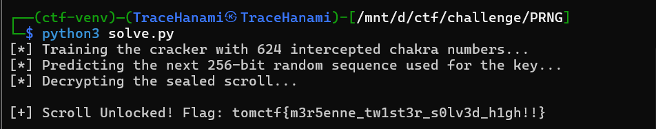

## TomCTF Writeup: Shinobi RNG

Welcome back, hackers. Today we're intercepting a secret jutsu from the Hidden Leaf Village. This challenge, **Shinobi RNG**, shows why standard "random" functions in programming languages are a major security risk.

If you've ever wondered how attackers predict the "unpredictable," this challenge is the perfect hands-on introduction to **PRNG state recovery**.

### What You'll Learn

- How the **Mersenne Twister (MT19937)** algorithm works under the hood
- The difference between **PRNGs** (Pseudo-Random) and **CSPRNGs** (Cryptographically Secure)
- How to reconstruct the internal state of Python's `random` module using 624 intercepted outputs
- How to use the `randcrack` library to automate state recovery

### Tools Used

- **Python 3**
- **PyCryptodome** for AES decryption
- **RandCrack** for reversing the Mersenne Twister

---

## Challenge Overview

- **Event:** TomCTF
- **Category:** Cryptography
- **Difficulty:** Easy
- **Designer:** TraceHanami

**Description:** Naruto's secret jutsu relies on a hidden sequence of chakra numbers. You intercepted 624 of them and a sealed scroll. Can you predict the next number in the sequence and unlock the scroll?


---

## Step-by-Step Walkthrough

### Step 1: Inspect the Source Code

The flag is encrypted using **AES-ECB**. The key is derived from a 256-bit random integer generated *after* 624 other integers have been leaked.

Python

```markdown
import random
import os
import hashlib
from Crypto.Cipher import AES
from Crypto.Util.Padding import pad

# Simplified logic from sample.py
rng = random.Random()
rng.seed(int.from_bytes(os.urandom(8), "big"))

# 1. 624 calls to getrandbits(32) are leaked to us
outputs = [rng.getrandbits(32) for _ in range(624)]

# 2. The 625th call is used for the key
key_val = rng.getrandbits(256)
key = hashlib.sha256(str(key_val).encode()).digest()[:16]

cipher = AES.new(key, AES.MODE_ECB)
ct = cipher.encrypt(pad(FLAG, 16))
```

### Step 2: Understand the Mersenne Twister

Python's `random` module uses the **MT19937** algorithm, which maintains an internal state of **624 integers**. Every time you request a number, it "tempers" one of these integers and returns it.

**The critical flaw:** The tempering process is reversible. If we see 624 consecutive 32-bit outputs, we can "untemper" them to reconstruct the generator's exact internal state. Once we have the state, we can predict every future number perfectly.

### Step 3: Crack the State

Instead of writing the complex bit-shifting math from scratch, we use `randcrack`. It takes 624 values, reverses the math, and "clones" the RNG.

### Step 4: Build the Exploit

We feed the intercepted numbers into our cracker, predict the next 256 bits, and use that to decrypt the scroll.

---

## The Solve Script

Create a file named `solve.py` with the following logic:

```python
import hashlib
from Crypto.Cipher import AES
from Crypto.Util.Padding import unpad
from randcrack import RandCrack

# -- 1. INTERCEPTED DATA ---
# The Mersenne Twister (MT19937) has a state space of 624 32-bit integers.
# Providing exactly 624 outputs allows us to fully reconstruct the internal state.
outputs = [
    519181880, 3302163511, 412442130, 3775209881, 46378359, 534220179, 1201701749,
    # ... (skipping for brevity, but all 624 are required) ...
    196569914
]

ct_hex = "d42b4c94a738e86fd9ab0d2c69497eb28344cf48735d2e49d824a5703b77e5a56e8d91249231791fa489eb7f20b6017a"

# -- 2. INITIALIZE AND TRAIN THE CRACKER ---
# RandCrack reverses the "tempering" transformations (bitwise shifts/XORs)
# applied to the MT19937 state array.
cracker = RandCrack()

print("[*] Training the cracker with 624 intercepted outputs...")
for val in outputs:
    cracker.submit(val)

# -- 3. PREDICT THE KEY VALUE ---
# Since the state is now synchronized, we can predict the next N bits.
# The challenge generated a 256-bit value for the key derivation immediately after the leaks.
print("[*] Predicting the 256-bit random sequence used for the AES key...")
predicted_val = cracker.predict_getrandbits(256)

# -- 4. RECONSTRUCT THE AES KEY ---
# The key derivation follows the challenge logic: SHA256(str(val))[:16]
key = hashlib.sha256(str(predicted_val).encode()).digest()[:16]
cipher = AES.new(key, AES.MODE_ECB)

# -- 5. DECRYPT AND UNLOCK ---
print("[*] Decrypting the ciphertext...")
try:
    encrypted_bytes = bytes.fromhex(ct_hex)
    decrypted = cipher.decrypt(encrypted_bytes)
    flag = unpad(decrypted, 16)
    print(f"\n[+] Success! Flag: {flag.decode()}")
except Exception as e:
    print(f"\n[-] Decryption failed: {e}")
```



---

## Final Thoughts

This challenge proves that **predictability is the enemy of security**. Even if you use a secure-looking 64-bit seed, the algorithm itself is vulnerable if it leaks enough data.

To fix this in the real world, always use the `secrets` module in Python, which is designed for cryptography and cannot be predicted this way.

Happy hacking, and I'll see you in the next write-up!

**Cheers,**

**TraceHanami**

---

**Flag:** `tomctf{m3r5enne_tw1st3r_s0lv3d_h1gh!!}`
