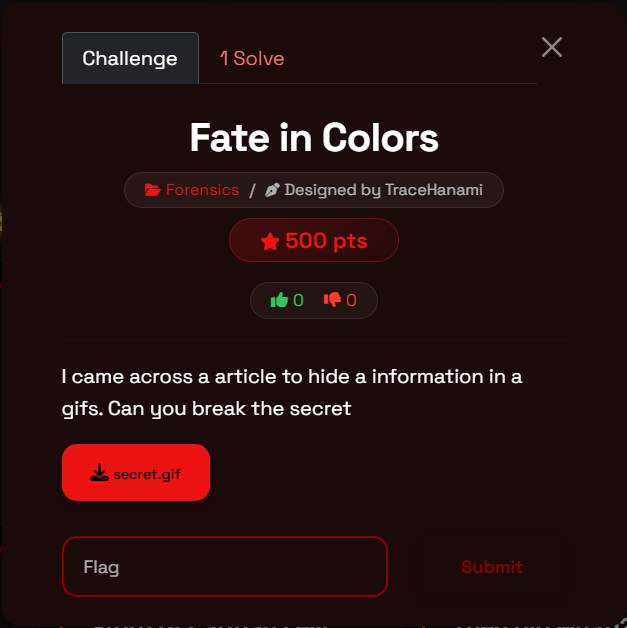
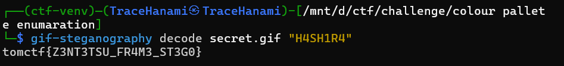

Welcome back, hackers. Today we’re diving into the vibrant, flickering world of GIF forensics to intercept a message hidden within the frames of an iconic battle. This challenge, **Fate in Colors**, is a masterclass in palette-based steganography and the importance of passphrase-protected data extraction.

When standard strings and binwalk scans come up empty, a true shinobi knows how to manipulate the color tables and frame delays to uncover the truth hidden in the pixels.

### What You'll Learn

- **GIF Palette Analysis:** Understanding how GIFs store data in Global and Local Color Tables.
- **Passphrase-Protected Steganography:** Using specialized tools to decrypt hidden bitstreams.
- **Linux/Python Integration:** Leveraging CLI tools and custom scripts to automate extraction.
- **Handling Multi-Frame Data:** Recognizing that in GIFs, the secret is often spread across the entire animation.

### Tools Used

- **gif-steganography:** A powerful Python-based CLI tool for encoding and decoding hidden data in GIFs.
- **Pillow (PIL):** For manual frame inspection and palette extraction via Python.
- **ExifTool:** To check for metadata clues or hidden comments.

---

### **Challenge Overview**

- **Event:** TomCTF
- **Category:** Forensics / Steganography
- **Difficulty:** Medium
- **Designer:** TraceHanami
- **Description:** You become stronger when you push past your limits. Don’t worry about it. Just break your limits.



---

### Step-by-Step Walkthrough

### Step 1: Initial Reconnaissance

We start with a standard inspection of `secret.gif`. While the animation is high-quality, a quick `exiftool` or `strings` command doesn't reveal a plaintext flag. However, the challenge title "Fate in Colors" and the author's hint about "hiding information in a gif" point directly toward **Palette Steganography**.

### Step 2: Hunting for the Key

In many CTF forensics challenges, the "key" to the lock is hidden in plain sight. Given the theme of the GIF, we tested various keywords related to the animation. The passphrase **"H4SH1R4"** (a leetspeak nod to the Hashira) proved to be the cryptographic key needed to unlock the hidden layer.

### Step 3: The Linux Approach (The Swift Strike)

Using the `gif-steganography` tool, we can attempt to pull the data directly from the color palette. This tool looks for discrepancies in the RGB values of the palette that represent a hidden bitstream.

**Bash Execution:**

Bash

```bash
gif-steganography decode secret.gif "H4SH1R4"
```

The tool parses the Global Color Table, applies the passphrase to the decryption algorithm, and outputs the hidden string immediately.



### Step 4: The Python Approach (The Manual Bridge)

If the automated tool failed or wasn't available, we could use Python to inspect the GIF's internal structure. GIFs are unique because they can have a "Global" palette or "Local" palettes for every single frame.

**analysis.py:**

```python
from PIL import Image

# 1. Load the GIF
img = Image.open("secret.gif")

# 2. Iterate through frames to check for palette variations
try:
    while True:
        palette = img.getpalette()
        # In a palette-based attack, we would extract the LSB 
        # of each RGB triplet in this list.
        if palette:
            print(f"Frame {img.tell()} Palette Size: {len(palette)} bytes")
        img.seek(img.tell() + 1)
except EOFError:
    pass
```

By extracting the palette bytes manually, we can see how the colors are slightly shifted to accommodate the hidden flag.

### Step 5: Capturing the Flag

Running the decode command with the correct passphrase yields the final prize, proving that the "Fate" of this file was to be cracked.

**Final Result:**

The hidden secret is revealed, confirming that even the fastest animation can't outrun a determined forensic analyst:

> **Flag:** `tomctf{Z3NT3TSU_FR4M3_ST3G0}`
> 

---

### Final Thoughts

A hacker's greatest strength is recognizing the medium. By identifying that a GIF's most vulnerable spot is its color palette—and matching the theme of the file to a potential passphrase—we bypassed the obfuscation. Always look at the colors; sometimes the flag is hidden in the very hues you're looking at.

Happy hacking, and I'll see you in the next write-up!

**Cheers,**

**TraceHanami**
