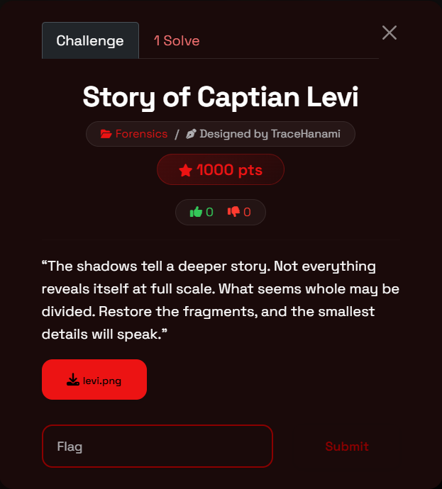
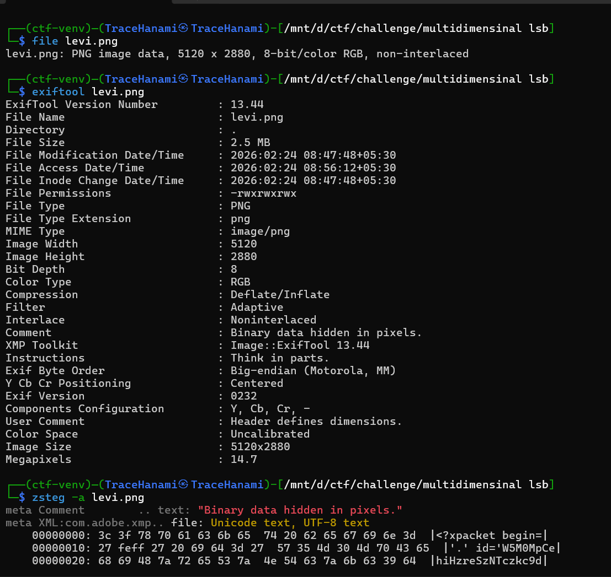
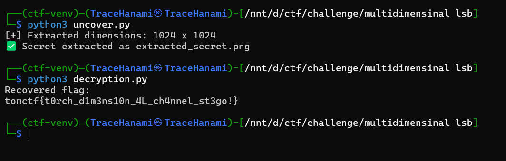

Welcome back, hackers.

In this challenge from **TomCTF**, we dive into a layered steganography puzzle inspired by Captain Levi from **Attack on Titan**.

At first glance, `levi.png` looks ordinary. But like any good reconnaissance mission, what matters is beneath the surface.

This challenge demonstrates **nested LSB steganography combined with spatial reconstruction** — meaning the hidden data is itself another structured container.

If you've ever extracted something only to realize it's not the final answer — this is exactly that scenario.

---

# What You'll Learn

- Nested LSB steganography
- Binary header parsing using `struct`
- Raw grayscale image reconstruction
- Spatial fragmentation (quadrant splitting)
- Bit integrity preservation using nearest-neighbor scaling
- Delimiter-based extraction logic

---

# Challenge Overview

- **Event**: TomCTF
- **Category**: Forensics
- **Difficulty**: Medium / Hard
- **Description**:
    
    *"The shadows tell a deeper story. Not everything reveals itself at full scale. What seems whole may be divided. Restore the fragments, and the smallest details will speak."*
    
    
    

---

# Step-by-Step Walkthrough

---

# Step 1: Initial Recon

We begin with basic analysis:

```
file levi.png
exiftool levi.png
zsteg-a levi.png
```

Metadata reveals nothing suspicious.



However:

```
zsteg-a levi.png
```

Reveals a massive bitplane payload in the LSB layer.

This is our first signal:

> The image contains structured LSB data — not random noise.
> 

Unlike simple stego flags, the extracted data is not ASCII-readable text.

This implies:

- Either compression
- Or structured binary format

---

# Step 2: Extracting the Hidden Image (First Layer)

This challenge uses **Nested LSB Steganography**.

The entire LSB stream of `levi.png` forms another image.

---

## Extraction Logic

We:

1. Flatten pixel array
2. Extract every LSB bit
3. Convert bitstream → bytes
4. Read first 8 bytes as header
5. Interpret as width and height (Big Endian)
6. Reshape remaining bytes into grayscale image

---

## Python Extraction Script (`uncover.py`)

```
fromPILimportImage
importnumpyasnp
importstruct

# Load stego image
stego=Image.open("levi.png")
stego_data=np.array(stego)
stego_flat=stego_data.flatten()

# Extract all LSBs
bits= [str(byte&1)forbyteinstego_flat]
bit_string=''.join(bits)

defbits_to_bytes(bit_str):
returnbytes(
int(bit_str[i:i+8],2)
foriinrange(0,len(bit_str),8)
    )

extracted_bytes=bits_to_bytes(bit_string)

# Read header (first 8 bytes)
width,height=struct.unpack(">II",extracted_bytes[:8])
print(f"[+] Extracted dimensions:{width} x{height}")

# Extract image payload
image_bytes=extracted_bytes[8:8+ (width*height)]

# Reconstruct grayscale image
image_array=np.frombuffer(image_bytes,dtype=np.uint8)
image_array=image_array.reshape((height,width))

Image.fromarray(image_array).save("extracted_secret.png")

print("Secret extracted as extracted_secret.png")
```

---

## Result

The extracted dimensions:

```
1024 x 1024
```

So the LSB payload was:

```
[ 8-byte header ][ 1024 × 1024 grayscale pixels ]
```

We now obtain:

```
extracted_secret.png
```

This confirms:

> The first layer did not hide text — it hid an image.
> 

---

# Step 3: Spatial Fragmentation

The description hinted:

> “What seems whole may be divided.”
> 

The reconstructed image is 1024×1024.

Dividing into quadrants:

- Top Left → 512×512
- Top Right → 512×512
- Bottom Left → 512×512
- Bottom Right → 512×512

Each quadrant appears to contain structured LSB noise.

---

# Step 4: Understanding the Scaling Trick

The quadrants were originally:

```
256 × 256
```

Then scaled up to:

```
512 × 512
```

This means each pixel was duplicated.

To preserve bit integrity, we must downscale using:

```
Image.NEAREST
```

Why?

Because:

- Bilinear or bicubic interpolation alters pixel values
- Altered pixel values corrupt LSB bits
- Nearest-neighbor preserves exact bit patterns

---

# Step 5: Extracting Flag Fragments (Second Layer)

Each quadrant contains:

```
flag_part + ###END###
```

We extract LSB bits again, convert to characters, and stop at delimiter.

---

## Decryption Script (`decryption.py`)

```
fromPILimportImage
importnumpyasnp

DELIMITER="###END###"

defextract_lsb_from_image(img):
data=np.array(img)
flat=data.flatten()

bits= []
forpixelinflat:
bits.append(str(pixel&1))

chars= []
foriinrange(0,len(bits),8):
byte=bits[i:i+8]
char=chr(int(''.join(byte),2))
chars.append(char)

if''.join(chars).endswith(DELIMITER):
break

return''.join(chars).replace(DELIMITER,"")

img=Image.open("extracted_secret.png").convert("L")

# Crop and resize quadrants
q1=img.crop((0,0,512,512)).resize((256,256),Image.NEAREST)
q2=img.crop((512,0,1024,512)).resize((256,256),Image.NEAREST)
q3=img.crop((0,512,512,1024)).resize((256,256),Image.NEAREST)
q4=img.crop((512,512,1024,1024)).resize((256,256),Image.NEAREST)

part1=extract_lsb_from_image(q1)
part2=extract_lsb_from_image(q2)
part3=extract_lsb_from_image(q3)
part4=extract_lsb_from_image(q4)

flag=part1+part2+part3+part4

print("Recovered flag:")
print(flag)
```

---

# Step 6: Final Reconstruction

Concatenating fragments gives:

```
tomctf{t0rch_d1m3ns10n_4L_ch4nnel_st3go!}
```

---



# Linux Command-Line Alternative

```
# Extract LSB payload
zsteg-e b1,bgr,lsb,xy levi.png | tail-c+9 > secret.raw

# Rebuild hidden image
convert-size 1024x1024-depth8 gray:secret.raw extracted_secret.png

# Crop and downscale
convert extracted_secret.png-crop 512x512+0+0-resize 256x256 q1.png

# Extract fragment
zsteg-e b1,gray,lsb,xy q1.png |awk-F"###END###"'{print $1}'
```

---

# Why This Challenge Is Interesting

This is not basic LSB.

It combines:

1. Full-bitplane extraction
2. Structured binary header parsing
3. Raw pixel reconstruction
4. Spatial fragmentation
5. Scaling reversal
6. Nested LSB decoding

It forces you to think recursively.

The flag was hidden:

- Inside quadrants
- Inside an image
- Inside another image

A true **multi-dimensional stego chain**.

---

# Final Thoughts

This challenge from TomCTF demonstrates that forensics often involves peeling back multiple layers.

Not every extraction gives you the answer.

Sometimes it gives you the next container.

And sometimes, that container is cleverly divided.

---

**Flag:**

```
tomctf{t0rch_d1m3ns10n_4L_ch4nnel_st3go!}
```
