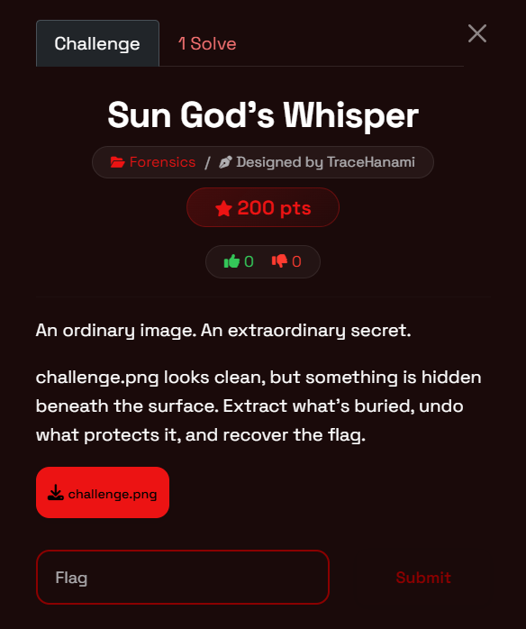
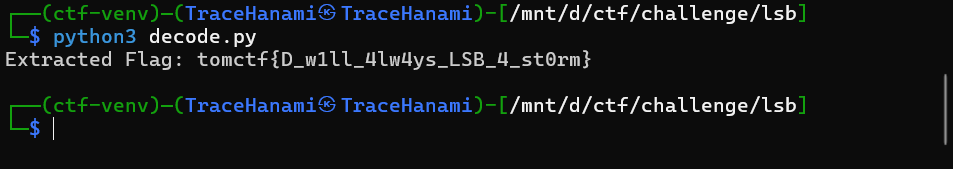
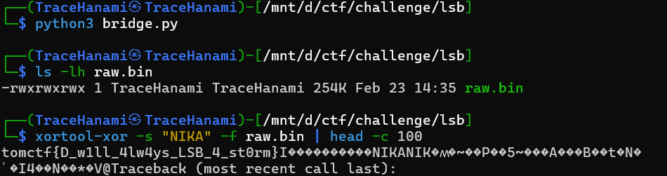

Welcome back, hackers. Today we’re setting sail with a challenge inspired by the "Warrior of Liberation" from *One Piece*. This challenge, **Sun God’s Whisper**, is a classic study in data embedding and bit-level obfuscation. It forces you to look past the pixels and see the binary truth hiding in the color channels.

If you've ever looked at a perfectly normal image and wondered if it was whispering a secret, this is the perfect hands-on introduction to LSB steganography and XOR encryption.

### What You'll Learn

- **LSB Steganography:** How to hide data in the Least Significant Bits of an image.
- **Channel Analysis:** Why the Blue channel is a common target for data hiding.
- **XOR Cryptography:** How a simple bitwise "exclusive or" protects data using a repeating key.
- **Metadata Reconnaissance:** Using Exif data to find cryptographic keys.

### Tools Used

- **ExifTool:** To inspect image metadata for hidden clues.
- **Python 3 (Pillow):** For programmatic pixel extraction.
- **zsteg / xortool (Linux):** For rapid command-line analysis.

---

### Challenge Overview

- **Event:** TomCTF
- **Category:** Forensics / Cryptography
- **Difficulty:** Easy
- **Designer:** TraceHanami
- **Description:** An ordinary image of the Sun God. An extraordinary secret. The image looks clean, but something is hidden beneath the surface. Extract what’s buried, undo what protects it, and recover the flag.



### Step-by-Step Walkthrough

### Step 1: Hunting for the Key

Before touching the pixels, we check the "low-hanging fruit" of image forensics: the metadata. We run `exiftool` on the challenge file.

```bash
exiftool challenge.png
```

Hidden in the `Comment` field, we find a hint: *"The key to liberation is NIKA."* In the context of the challenge theme, **NIKA** is our decryption key.

### Step 2: Understanding LSB Steganography

The challenge uses **Least Significant Bit (LSB)** encoding. Digital images represent colors using bytes (0-255). By modifying only the last bit `($2^0$)` of a color value, the visual change is so minute `($1/255^{th}$)` of the intensity) that it is invisible to the human eye.

The provided script reveals the target is the **Blue channel**. We need to harvest the 0th bit from every blue pixel, group them into 8-bit bytes, and convert them to characters.

We start with a standard `zsteg` scan. Immediately, a flag appears in the "extra data" (bytes appended after the image end chunk):
`tomctf{n1c3_try_but_th3_r34l_tr34sur3_1s_d33p3r}`

As the flag itself warns, this is a **Red Herring**. The designer is testing your patience. The real flag is embedded *inside* the image data.

While `zsteg` failed at extraction, its metadata scan was crucial. Under the `Comment` field, we found the hex values `4e 49 4b 41`. Converting this to ASCII gives us **NIKA**. This is the cryptographic key to liberation.

### Step 3: Reversing the XOR "Whisper"

Once the bits are extracted, they form an encrypted string. To "undo" the protection mentioned in the description, we apply an XOR cipher using our key, **NIKA**.

In XOR encryption, the key repeats over the message. Because XOR is its own inverse, applying the same key to the ciphertext reveals the flag.

### Step 4: The Build and Solve

We can solve this using two different approaches depending on our environment.

**The Python Script (`solve.py`)**

Python

```python
from PIL import Image

# 1. Load Image
img = Image.open("challenge.png").convert('RGBA')
pixels = img.load()
width, height = img.size
key = "NIKA"

# 2. Extract Blue LSBs
binary_data = ""
for y in range(height):
    for x in range(width):
        r, g, b, a = pixels[x, y]
        binary_data += str(b & 1)

# 3. Bit-to-Char Conversion
all_bytes = [binary_data[i:i+8] for i in range(0, len(binary_data), 8)]
decoded_chars = []
for byte in all_bytes:
    char_code = int(byte, 2)
    if char_code == 0: break # Stop at Null
    decoded_chars.append(chr(char_code))

encrypted_msg = "".join(decoded_chars)

# 4. XOR Decryption
flag = "".join(chr(ord(c) ^ ord(key[i % len(key)])) for i, c in enumerate(encrypted_msg))
print(f"[+] Flag Recovered: {flag}")
```



**The Linux Command Line**

If you have `zsteg` and `xortool` installed, you can skip the coding:

Bash

```bash
# Extract the raw LSB data from Blue channel
zsteg -E "b1,lsb,xy" challenge.png > raw.bin

# Decrypt using the key NIKA
xortool-xor -s "NIKA" -f raw.bin
```



---

Final Thoughts

This challenge demonstrates that forensics is about layers. The "Sun God" isn't just a picture; it's a storage container. By identifying the LSB modification in the Blue channel and correlating the metadata key, we were able to hear the "whisper" hidden in the data.

Happy hacking, and I'll see you in the next write-up!

**Cheers, TraceHanami**

**Flag:** `tomctf{D_w1ll_4lw4ys_LSB_4_st0rm}`
