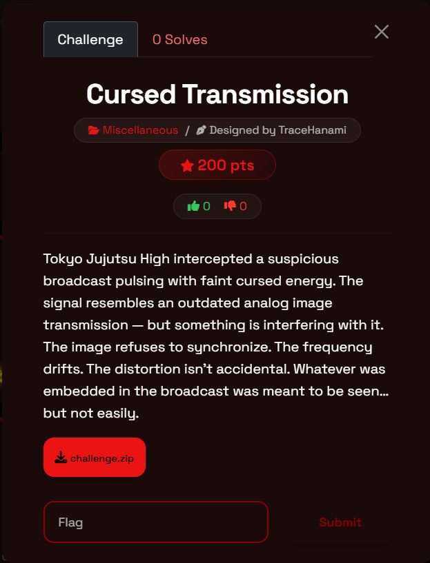
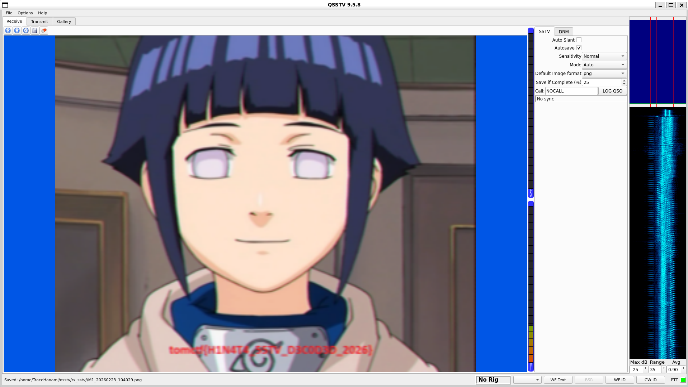

Welcome back, exorcists. Today we’re intercepting a broadcast that feels like it’s straight out of Tokyo Jujutsu High. This challenge, **Cursed Transmission**, is a classic study in signal forensics and analog-to-digital recovery. It forces you to look past the "cursed energy" interference and find the frequency that holds the truth.

If you've ever heard a series of rhythmic chirps and screeches in a CTF audio file, you've encountered the language of the airwaves. This is your hands-on introduction to **SSTV (Slow Scan Television)** decoding.

### What You'll Learn

- **Signal Identification:** Recognizing the signature sounds of analog image transmissions.
- **SSTV Decoding:** Using software to translate audio frequencies into visual scanlines.
- **Synchronization & Slant:** Correcting frequency drifts to reveal a clear image.
- **Visual Steganography:** Recovering flags embedded directly within decoded media.

### Tools Used

- **QSSTV (Linux):** A powerful open-source tool for receiving and decoding radio signals.
- **MMSSTV (Windows):** A popular, user-friendly choice for decoding SSTV with manual fine-tuning.
- **Robot36 (Android):** Useful for quick, mobile-based decoding via the microphone.

---

### Challenge Overview

- **Event:** TomCTF
- **Category:** Miscellaneous
- **Difficulty:** 200 pts
- **Designer:** TraceHanami
- **Description:** Tokyo Jujutsu High intercepted a suspicious broadcast pulsing with faint cursed energy. The signal resembles an outdated analog image transmission—but something is interfering with it. The image refuses to synchronize and the frequency drifts. The distortion isn’t accidental; whatever was embedded was meant to be seen... but not easily.

---

### Step-by-Step Walkthrough

### Step 1: Listening to the Curse

The challenge provides a `challenge.zip` containing an audio file. Opening the file reveals a series of rhythmic, high-pitched "chirps" and "warbles." In forensics, this is a textbook signature of **SSTV**. The challenge description’s mention of "analog image transmission" and "synchronization" issues confirms we need to treat this audio as a visual signal.

### Step 2: Tuning the Receiver

To decode the "cursed" signal, we need a tool that can interpret these frequencies.

**Using QSSTV or MMSSTV:**

1. **Set the Input:** Configure the software to listen to your system's audio output (e.g., using "Stereo Mix" or a Virtual Audio Cable).
2. **Auto-Detect:** Start the audio playback. The software should recognize the SSTV header and begin "painting" the image line-by-line.
3. **Handling the Drift:** The challenge warns that the "frequency drifts" and "refuses to synchronize". If the image looks slanted or distorted, we use the **Slant** or **Sync** adjustments in the software to realign the scanlines until the image becomes legible.

### Step 3: Banishing the Distortion

As the audio plays through, a clear image begins to emerge from the noise. The "cursed energy" was simply an SSTV transmission of a familiar character, Hinata Hyuga. By properly synchronizing the frequency, the hidden text at the bottom of the image becomes readable.

### Step 4: The Build and Solve

The result of a successful decode reveals the following image:

**Decoded Image:**

The red text at the bottom provides the final flag.

---

### Final Thoughts

This challenge demonstrates that even "cursed" signals follow the laws of physics. By identifying the transmission method as SSTV and correcting for the intentional frequency drift, we were able to recover the hidden broadcast. Forensics is often about finding the right "lens"—or in this case, the right frequency—to see what is hidden in plain sight.

Happy hacking, and I'll see you in the next write-up!

**Cheers, TraceHanami**

**Flag:** `tomctf{H1N4T4_55TV_D3C0D3D_2026}`
