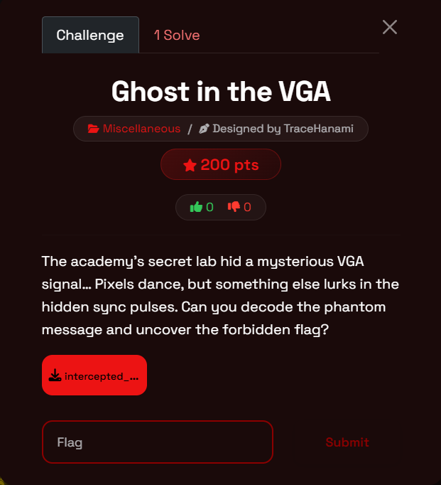
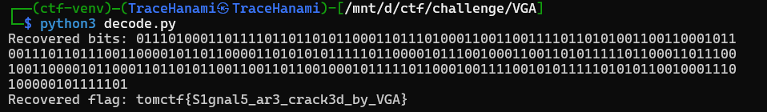

Welcome back, hackers. Today we’re diving into a signal processing challenge that feels straight out of a Cold War spy flick. This challenge, **Ghost in the VGA**, is a masterclass in temporal steganography. It forces you to look past the pixels and see the binary truth hiding in the synchronization pulses.

If you've ever looked at a monitor and wondered how it knows exactly when to start a new line of pixels, this is the perfect hands-on introduction to VGA timing and pulse-width modulation.

### **What You'll Learn**

- **VGA Protocol:** How Horizontal Sync (HSYNC) pulses control display timing.
- **Signal Analysis:** Identifying patterns in raw hardware-intercepted data.
- **Pulse Width Modulation (PWM):** How varying the duration of a signal can encode binary information.
- **Data Recovery:** Using Python and Linux tools to automate the extraction of hidden bits.

### **Tools Used**

- **Numpy:** For high-speed processing of large numerical CSV datasets.
- **Python 3:** To build a custom decoder for specific pulse widths.
- **AWK (Linux):** For rapid command-line pattern recognition and counting.

---

### **Challenge Overview**

- **Event:** TomCTF
- **Category:** Miscellaneous
- **Difficulty:** Easy/Medium
- **Designer:** TraceHanami
- **Description:** The academy’s secret lab hid a mysterious VGA signal... Pixels dance, but something else lurks in the hidden sync pulses. Can you decode the phantom message and uncover the forbidden flag?



---

### **Step-by-Step Walkthrough**

### **Step 1: Hunting for the Protocol**

The challenge title and description explicitly mention **VGA** and **Sync Pulses**. In a standard VGA signal, the HSYNC pulse is a "low" signal that tells the monitor to move the electron beam back to the start of the next line.

When we open `intercepted_signal.csv`, we see a stream of numbers. By scanning the data, we notice a recurring pattern: most values represent pixel intensities, but periodically, we hit a sequence of **-1** values. These are our HSYNC pulses.

### **Step 2: Understanding the Encoding**

In this "Ghost" signal, the designer isn't using standard VGA timings. Instead, they’ve modified the **width** (the number of consecutive -1s) to represent bits:

- **96 samples** of -1 = Binary `0`
- **100 samples** of -1 = Binary `1`

The pixels are just "dancing" to distract you; the real data is in the timing of the black-out period.

### **Step 3: Extracting the "Phantom" Message**

We need to iterate through the signal, find every HSYNC pulse, measure its length, and map it to a bit. Because hardware captures aren't always perfect, we use a **Tolerance (TOL)** of ±2 to account for jitter.

### **Step 4: The Build and Solve**

We can solve this using two different approaches depending on our environment.

### **The Python Script (`decode.py`)**

**Python**

```markdown
`import numpy as np

FILE = "intercepted_signal.csv"
LINE_WIDTH = 800  # Total samples per horizontal line

# Expected widths for bits
ZERO_WIDTH = 96
ONE_WIDTH = 100
TOL = 2 

def main():
    # 1. Load the raw signal data
    data = np.loadtxt(FILE, delimiter=",")
    total_lines = len(data) // LINE_WIDTH
    bits = ""

    # 2. Iterate through each horizontal line
    for i in range(total_lines):
        line = data[i * LINE_WIDTH : (i + 1) * LINE_WIDTH]

        # 3. Detect HSYNC pulse (-1 values)
        pulse_width = 0
        for val in line:
            if val == -1:
                pulse_width += 1
            elif pulse_width > 0:
                break 

        # 4. Classify width as a bit
        if abs(pulse_width - ZERO_WIDTH) <= TOL:
            bits += '0'
        elif abs(pulse_width - ONE_WIDTH) <= TOL:
            bits += '1'

    # 5. Convert bits to ASCII
    flag = "".join(chr(int(bits[i:i+8], 2)) for i in range(0, len(bits), 8) if len(bits[i:i+8]) == 8)
    print(f"Recovered flag: {flag}")

if __name__ == "__main__":
    main()`
```



### **The Linux Command Line**

If you want to solve this without leaving the terminal, a combination of `tr`, `awk`, and `perl` does the trick beautifully:

**Bash**

```markdown
# Convert CSV to rows, count consecutive -1s, map to bits, and convert to ASCII
cat intercepted_signal.csv | tr ',' '\n' | \
awk 'BEGIN {c=0} {if($1==-1) c++; else if(c>0){print c; c=0}}' | \
awk '{if($1==96) printf "0"; else if($1==100) printf "1"}' | \
perl -lpe '$_=pack "B*", $_'
```

---

### **Final Thoughts**

This challenge demonstrates that information isn't always hidden *in* the data (the pixels); sometimes, it's hidden in the *metadata of time* (the pulses). By understanding the underlying protocol of the VGA standard, we were able to isolate the anomalies and reconstruct the message.

Happy hacking, and I'll see you in the next write-up!

Cheers,
**TraceHanami**

**Flag: `tomctf{S1gnal5_ar3_crack3d_by_VGA}`**
