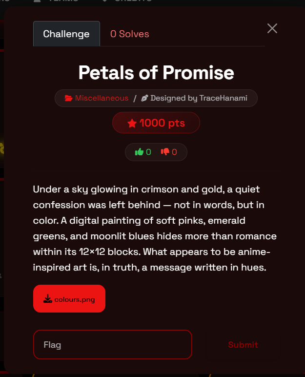
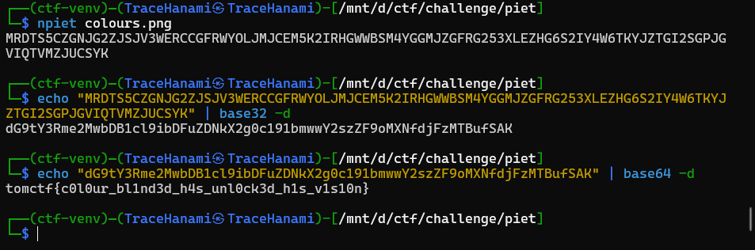

Welcome back, hackers. Today we’re tackling a challenge that literally requires you to "think in color." This challenge, **Petals of Promise**, is a classic example of esoteric programming language execution combined with multi-layered encoding. It forces you to question the artistic integrity of what you see and realize that an image's canvas is sometimes a functional script.

If you've ever felt like a piece of art was trying to tell you something, it’s probably because the code was hidden right in the hues.

### What You'll Learn

- **Esoteric Languages:** Identifying and executing Piet programs.
- **Codel Logic:** Understanding how pixel blocks ($12 \times 12$) function as single units of code.
- **Encoding Onions:** Recognizing and decoding nested Base32 and Base64 strings.
- **Piet Commands:** How transitions in hue and lightness trigger stack operations.

### Tools Used

- **npiet:** An interpreter used to execute Piet images.
- **Base32/Base64:** Standard command-line utilities for decoding data streams.

### Challenge Overview

- **Event:** TomCTF
- **Category:** Miscellaneous / Steganography
- **Difficulty:** Easy
- **Designer:** TraceHanami
- **Description:** Under a sky glowing in crimson and gold, a quiet confession was left behind — not in words, but in color. A digital painting hides more than romance within its $12 \times 12$ blocks.

---

### Step-by-Step Walkthrough

### Step 1: Decoding the Visual Script

We start by inspecting the provided file, `colours.png`. The description mentions "12x12 blocks" and "a message written in hues," which is the universal calling card for the **Piet** esoteric language. In Piet, the program's behavior is defined by the change in color between "codels."

### Step 2: Executing the Piet Code

Using `npiet`, we point the interpreter at the image. We specify the codel size of 12 as hinted in the challenge description to ensure the interpreter reads the blocks correctly.

**Command:**

Bash

`npiet colours.png`

**Output:**

`MRDTS5CZGNJG2ZJSJV3WERCCGFRWYOLJMJCEM5K2IRHGWWBSM4YGGMJZGFRG253XLEZHG6S2IY4W6TKYJZTGI2SGPJGVIQTVMZJUCSYK`

### Step 3: Peeling the First Layer (Base32)

The output from the Piet program is a long string of uppercase letters and numbers (2-7), which is characteristic of **Base32** encoding.

**Command:**

Bash

`echo "MRDTS...CSYK" | base32 -d`

**Result:**

`dG9tY3Rme2N0b0VyX2JsMW5kM2RfaDRzX3VubDBja3NkX2gxcy12MXMxMG4}`

### Step 4: Peeling the Second Layer (Base64)

The resulting string is case-sensitive and starts with `dG9t` (the Base64 equivalent of "tom"), indicating a **Base64** layer.

**Command:**

Bash

`echo "dG9tY...SAK" | base64 -d`

**Final Flag:**

`tomctf{c0l0ur_bl1nd3d_h4s_unl0ck3d_h1s_v1s10n}`

---

### The Result

Upon stripping away the esoteric execution and the dual layers of encoding, the "confession in color" is revealed as the final flag.

**Flag:** `tomctf{c0l0ur_bl1nd3d_h4s_unl0ck3d_h1s_v1s10n}`

### Final Thoughts

This challenge proves that data can be beautiful and functional at the same time. By understanding how Piet interprets color transitions and recognizing common encoding patterns, you can extract secrets from even the most artistic "paintings."

Happy hacking, and I'll see you in the next write-up!

Cheers, TraceHanami
