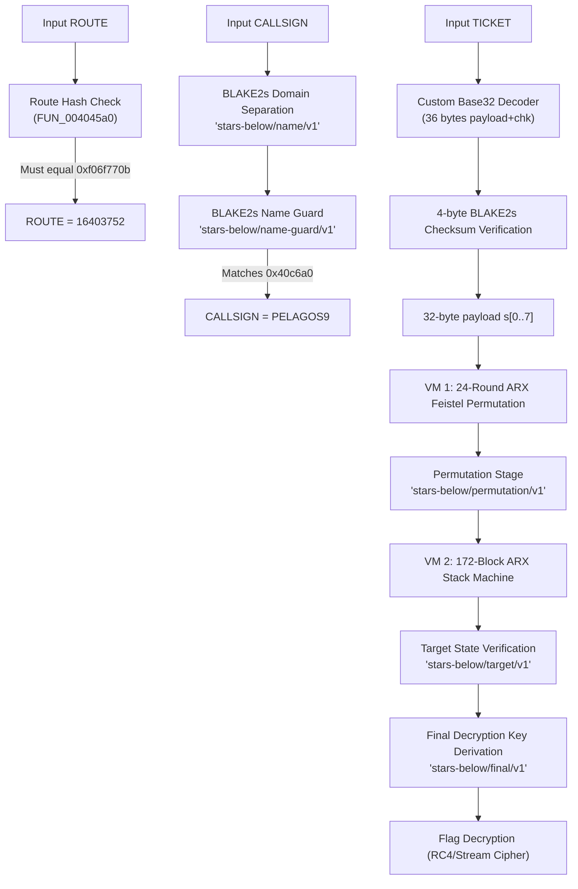

# Stars Below — Reverse Engineering Writeup

- **Category:** Reverse Engineering
- **Challenge Name:** Stars Below
- **Difficulty:** Extreme
- **Author:** afish
- **Target File:** `stars_below` (64-bit ELF stripped executable, SDL2 GUI + `--headless` mode)
- **Flag:** `zdk{7H3_LoaD3r_DrEAms_IN_pAg3_BOUND4RIES}`

---

## 1. Challenge Overview

We are provided with a 64-bit stripped Linux executable named `stars_below` and a `PUBLIC.md` document containing the following description:

> *The drowned observatory still charts a sky. Eight fragments remember the name of its last pilot; the relay remembers everything else.*
> 
> *Bring the fragments home in the right wake. Recover the pilot's ticket. Ask the stars below what they saw.*
> 
> *You are given one stripped Linux x86-64 executable. It requires SDL2. A display-free verifier is available as:*
> ```text
> ./stars_below --headless ROUTE CALLSIGN TICKET
> ```

Running the binary without arguments launches an interactive SDL2 graphical interface where the player navigates an underwater craft to collect 8 numbered fragments (0–7) before inputting a callsign and a ticket at a terminal. Running `--headless` requires three command-line arguments:
1. `ROUTE`
2. `CALLSIGN`
3. `TICKET`

---

## 2. Binary Analysis & Architecture

Decompiling the binary in Ghidra and inspecting disassembled routines reveals the verification architecture:



---

## 3. Step 1: Solving `ROUTE`

In headless mode, `argv[2]` (`ROUTE`) is processed by `FUN_004045a0`:

```c
uint FUN_004045a0(char *param_1) {
    char cVar1;
    byte bVar2;
    uint uVar3 = 0x1799b0e8, uVar4, uVar5 = 0, uVar6 = 0;
    
    cVar1 = *param_1;
    if (cVar1 != '\0') {
        do {
            param_1++;
            if ((1 < (byte)(cVar1 - 0x2cU)) && (cVar1 != ' ')) {
                if (7 < (byte)(cVar1 - '0') || 7 < uVar5) return 0;
                uVar4 = (int)cVar1 - '0';
                if ((uVar6 >> (uVar4 & 0x1f) & 1) != 0) return 0;
                uVar6 |= 1 << (uVar4 & 0x1f);
                bVar2 = (byte)uVar4 + (char)uVar5 * 5 & 0x1f;
                uVar3 = uVar5 + 0x9e3779b9 +
                        ((uVar3 ^ DAT_004077e0[uVar4]) << bVar2 |
                         (uVar3 ^ DAT_004077e0[uVar4]) >> (32 - bVar2));
                uVar5++;
            }
            cVar1 = *param_1;
        } while (cVar1 != '\0');
        if (uVar5 == 8 && uVar6 == 0xff) return uVar3;
    }
    return 0;
}
```

The algorithm validates that `ROUTE` is a permutation of the 8 digits `0..7`. Later in `FUN_00404680`, the resulting hash is checked:

$$\text{hash} == \texttt{0xf06f770b}$$

Brute-forcing all $8! = 40,320$ permutations in Python takes < 0.05s:

```python
import itertools, struct

table = [0x65c39a14, 0xa308269a, 0x990f017c, 0x55f4d8ce, 0x89d5619f, 0xe7c6c00f, 0xba900e4, 0x6bbe942e]

def route_hash(p):
    u3, u5, u6 = 0x1799b0e8, 0, 0
    for val in p:
        u6 |= (1 << val)
        b2 = (val + u5 * 5) & 0x1f
        t = (u3 ^ table[val]) & 0xffffffff
        rot = ((t << b2) | (t >> (32 - b2))) & 0xffffffff
        u3 = (u5 + 0x9e3779b9 + rot) & 0xffffffff
        u5 += 1
    return u3

for p in itertools.permutations(range(8)):
    if route_hash(p) == 0xf06f770b:
        print("ROUTE:", "".join(map(str, p))) # 16403752
        break
```

**Result:** `ROUTE = 16403752`

---

## 4. Step 2: Solving `CALLSIGN`

In `FUN_00404640`, each fragment index maps to an ASCII character:
```c
char FUN_00404640(uint param_1) {
    if (param_1 < 8) return "AP9GLSEO"[param_1];
    return '?';
}
```

Visiting the fragments in the order of the discovered route `1, 6, 4, 0, 3, 7, 5, 2`:
- $1 \to \text{P}$
- $6 \to \text{E}$
- $4 \to \text{L}$
- $0 \to \text{A}$
- $3 \to \text{G}$
- $7 \to \text{O}$
- $5 \to \text{S}$
- $2 \to \text{9}$

The binary hashes the callsign using BLAKE2s:
1. `h_name = blake2s("stars-below/name/v1\0" + len(name) + name)`
2. `h_guard = blake2s("stars-below/name-guard/v1\0" + salt_guard + h_name)`
3. It checks `h_guard == DAT_0040c6a0`.

Testing `PELAGOS9`:
```python
h1 = hashlib.blake2s(b"stars-below/name/v1\x00" + bytes([8]) + b"PELAGOS9").digest()
h2 = hashlib.blake2s(b"stars-below/name-guard/v1\x00" + guard_salt + h1).digest()
assert h2 == target_hash # True!
```

**Result:** `CALLSIGN = PELAGOS9`

---

## 5. Step 3: Solving `TICKET`

### 5.1 Ticket Structure & Encoding
The ticket argument is a 58-character Base32 string (alphabet `87RJF2ACZLVUMXB3D6GH9WNSYP5QK4ET`). 58 symbols $\times 5\text{ bits} = 290\text{ bits}$, which decodes to:
- **32-byte payload:** $s[0..7]$ (8 little-endian `uint32` values)
- **4-byte checksum:** $\text{BLAKE2s}(\texttt{"stars-below/ticket/v1\textbackslash 0"} + h\_name + payload)[0..3]$

### 5.2 Virtual Machine Architecture
The 32-byte payload $s[0..7]$ is verified through two chained virtual machines:

1. **VM 1:**
   - 1,417 instructions (24 rounds of ChaCha/Salsa-style ARX quarter-rounds on $s[0..7]$).
   - Generates intermediate state $st_{\text{vm1}}$.
2. **Permutation Stage:**
   - Permutes the 8 state words according to sort indices derived from $\text{BLAKE2s}(\texttt{"stars-below/permutation/v1\textbackslash 0"} + \dots)$.
3. **VM 2:**
   - 1,084 instructions (172 blocks of reversible ARX stack operations).
   - The final output must match a fixed target hash:
     $$\text{Target} = \text{BLAKE2s}(\texttt{"stars-below/target/v1\textbackslash 0"} + h\_name + salt_{\text{target}})$$

### 5.3 Inverting VM 2 and VM 1
Because every single operation in both VM 2 and VM 1 is an invertible ARX round over $\mathbb{Z}_{2^{32}}$:
- `ADD / SUB`: Inverted by subtracting/adding the constant.
- `ROL / ROR`: Inverted by rotating right/left by the same shift.
- `XOR`: Inverted by XORing with the same value.
- `SWAP`: Inverted by swapping again.

We write an exact analytical inverse for VM 2 and VM 1 in Python:

$$\text{Target} \xrightarrow{\text{Inv VM 2}} \text{VM 2 Initial State} \xrightarrow{\text{Inv Permutation}} \text{VM 1 Output} \xrightarrow{\text{Inv VM 1}} s[0..7]$$

```python
# Inverting VM 1 rounds:
for i1, i2, (sw1, sw2), sched in reversed(rounds_info):
    st[sw1], st[sw2] = st[sw2], st[sw1]
    inv_qr2(st, i2, sched)
    inv_qr1(st, i1, sched)
```

### 5.4 Recovered Payload & Ticket
Executing the inversion pipeline outputs the exact 32-byte payload:
$$\begin{aligned}
s[0] &= \texttt{0x565e6a68} & s[1] &= \texttt{0xc9dc5096} \\
s[2] &= \texttt{0x5b2fccee} & s[3] &= \texttt{0x09ccd41a} \\
s[4] &= \texttt{0xcf64e408} & s[5] &= \texttt{0x4f1f3cea} \\
s[6] &= \texttt{0x01c9a201} & s[7] &= \texttt{0x6e8ee8dc}
\end{aligned}$$

Appending the 4-byte checksum and encoding into Base32 gives:

$$\text{TICKET} = \mathbf{X7W2KW9NVJBMHQNM24X6WWAM7FFBZPA34ZE7EHY79UFDJSCZ6PSV8MSKRD}$$

---

## 6. Flag Recovery & Verification

We execute the binary with the three recovered credentials:

```bash
$ ./stars_below --headless 16403752 PELAGOS9 X7W2KW9NVJBMHQNM24X6WWAM7FFBZPA34ZE7EHY79UFDJSCZ6PSV8MSKRD
zdk{7H3_LoaD3r_DrEAms_IN_pAg3_BOUND4RIES}
```

---

## 7. Full Solver Script

```python
#!/usr/bin/env python3
import struct, hashlib

# 1. Load binary & constants
with open("stars_below", "rb") as f:
    data = f.read()

def read_bytes(addr, length):
    return data[addr - 0x407000 + 0x7000 : addr - 0x407000 + 0x7000 + length]

# 2. Route & Callsign
ROUTE = "16403752"
CALLSIGN = "PELAGOS9"
h_name = hashlib.blake2s(b"stars-below/name/v1\x00" + bytes([len(CALLSIGN)]) + CALLSIGN.encode()).digest()
h_name_u32 = struct.unpack("<8I", h_name)
route_hash = struct.pack("<I", 0xf06f770b)

# 3. Stream Cipher Decryption
def stream_decrypt(ciphertext, key):
    res = bytearray(ciphertext)
    for i in range((len(res) + 31) // 32):
        block_key = hashlib.blake2s(key + struct.pack("<I", i) + b"SBX1").digest()
        for j in range(32):
            idx = i * 32 + j
            if idx < len(res):
                res[idx] ^= block_key[j]
    return bytes(res)

key_a = hashlib.blake2s(b"stars-below/vm-a-key/v1\x00" + h_name + route_hash + read_bytes(0x40c6f0, 16)).digest()
vm1_bytes = stream_decrypt(read_bytes(0x409a40, 0x2c48), key_a)

key_b = hashlib.blake2s(b"stars-below/vm-b-key/v1\x00" + h_name + route_hash + hashlib.blake2s(vm1_bytes).digest() + read_bytes(0x40c6e0, 16)).digest()
vm2_bytes = stream_decrypt(read_bytes(0x407860, 0x21e0), key_b)

# 4. Schedule Generation
def generate_schedule(salt, tag_byte, count):
    entries = []
    for i in range(count):
        h = hashlib.blake2s(b"stars-below/schedule/v1\x00" + bytes([tag_byte]) + salt + h_name + struct.pack("<I", i)).digest()
        u32_arr = list(struct.unpack("<2I", h[0:8]))
        u32_arr.extend(struct.unpack("<2I", struct.pack("<Q", struct.unpack("<Q", h[8:16])[0] | 1)))
        u32_arr.extend(struct.unpack("<2I", struct.pack("<Q", (struct.unpack("<I", h[20:24])[0] << 32 | struct.unpack("<I", h[16:20])[0]) | (1 << 32))))
        bytes_arr = [((h[24 + l6] ^ h[8 + l6]) % 31) + 1 for l6 in range(6)]
        entries.append({"u32": u32_arr, "bytes": bytes_arr})
    return entries

sched_a = generate_schedule(read_bytes(0x40c720, 16), 0x41, 24)
sched_b = generate_schedule(read_bytes(0x40c710, 16), 0x42, 19)

def rol(x, n): return ((x << (n & 31)) | (x >> (32 - (n & 31)))) & 0xffffffff
def ror(x, n): return ((x >> (n & 31)) | (x << (32 - (n & 31)))) & 0xffffffff

# 5. Invert VM 2 from Target
target = hashlib.blake2s(b"stars-below/target/v1\x00" + h_name + read_bytes(0x40c730, 16)).digest()
st2 = list(struct.unpack("<8I", target))

vm2_opmap = [0x4c, 0x9d, 0xe7, 0xb9, 0x71, 0x32, 0xbd, 0x8a, 0xa8, 0x39, 0xed]
op_names = ["PUSH_ST", "PUSH_U32", "PUSH_BYTE", "ADD", "XOR", "MUL", "ROL", "ROR", "POP_ST", "SWAP", "HALT"]
blocks = []
cur_block = []
for pc in range(len(vm2_bytes) // 8):
    instr = vm2_bytes[pc*8 : (pc+1)*8]
    op = op_names[vm2_opmap.index(instr[0])]
    cur_block.append((pc, op, instr[1], instr[2], instr[3], struct.unpack("<I", instr[4:8])[0]))
    if op in ["POP_ST", "SWAP", "HALT"]:
        blocks.append(cur_block); cur_block = []

for blk in reversed(blocks):
    pat = " -> ".join(x[1] for x in blk)
    if pat == "HALT": continue
    elif pat == "SWAP":
        i1, i2 = blk[0][2] & 7, blk[0][5] & 7
        st2[i1], st2[i2] = st2[i2], st2[i1]
    elif pat == "PUSH_ST -> PUSH_ST -> PUSH_U32 -> ADD -> PUSH_BYTE -> ROL -> XOR -> POP_ST":
        tgt, src = blk[0][5] & 7, blk[1][5] & 7
        u_val = sched_b[(blk[2][5] >> 8) & 0xff]["u32"][blk[2][5] & 0xff]
        b_val = sched_b[(blk[4][5] >> 8) & 0xff]["bytes"][blk[4][5] & 0xff]
        st2[tgt] = (st2[tgt] ^ rol((st2[src] + u_val) & 0xffffffff, b_val)) & 0xffffffff
    elif pat == "PUSH_ST -> PUSH_ST -> PUSH_U32 -> MUL -> ADD -> POP_ST":
        tgt, src = blk[0][5] & 7, blk[1][5] & 7
        u_val = sched_b[(blk[2][5] >> 8) & 0xff]["u32"][blk[2][5] & 0xff]
        st2[tgt] = (st2[tgt] - (st2[src] * u_val)) & 0xffffffff
    elif pat == "PUSH_ST -> PUSH_ST -> XOR -> PUSH_BYTE -> ROL -> POP_ST":
        tgt, src = blk[0][5] & 7, blk[1][5] & 7
        b_val = sched_b[(blk[3][5] >> 8) & 0xff]["bytes"][blk[3][5] & 0xff]
        st2[tgt] = (ror(st2[tgt], b_val) ^ st2[src]) & 0xffffffff
    elif pat == "PUSH_ST -> PUSH_ST -> PUSH_U32 -> XOR -> PUSH_BYTE -> ROR -> ADD -> POP_ST":
        tgt, src = blk[0][5] & 7, blk[1][5] & 7
        u_val = sched_b[(blk[2][5] >> 8) & 0xff]["u32"][blk[2][5] & 0xff]
        b_val = sched_b[(blk[4][5] >> 8) & 0xff]["bytes"][blk[4][5] & 0xff]
        st2[tgt] = (st2[tgt] - ror(st2[src] ^ u_val, b_val)) & 0xffffffff

# 6. Invert Permutation Stage
perm_key = hashlib.blake2s(b"stars-below/permutation/v1\x00" + read_bytes(0x40c700, 16) + h_name).digest()
perm = list(read_bytes(0x4074a8, 8))
for j in range(1, 8):
    k = j
    while k > 0:
        if (perm_key[perm[k-1]] < perm_key[perm[k]]) or (perm_key[perm[k-1]] == perm_key[perm[k]] and perm[k-1] < perm[k]): break
        perm[k], perm[k-1] = perm[k-1], perm[k]; k -= 1

vm1_final = [0] * 8
for i in range(8):
    vm1_final[perm[i]] = st2[i] ^ rol(h_name_u32[i], i + 1)

# 7. Invert VM 1
def inv_qr1(st, i1, sched):
    a, b, c, d = i1
    st[b] = (st[b] ^ rol((st[d] + sched["u32"][1]) & 0xffffffff, sched["bytes"][2])) & 0xffffffff
    st[d] = (rol(st[d], sched["bytes"][1]) - st[c]) & 0xffffffff
    st[c] = (st[c] ^ ((st[a] * sched["u32"][2]) & 0xffffffff)) & 0xffffffff
    st[a] = (st[a] - rol(st[b] ^ sched["u32"][0], sched["bytes"][0])) & 0xffffffff

def inv_qr2(st, i2, sched):
    a, b, c, d = i2
    st[b] = (st[b] ^ rol((st[d] + sched["u32"][4]) & 0xffffffff, sched["bytes"][5])) & 0xffffffff
    st[d] = (rol(st[d], sched["bytes"][4]) - st[c]) & 0xffffffff
    st[c] = (st[c] ^ ((st[a] * sched["u32"][5]) & 0xffffffff)) & 0xffffffff
    st[a] = (st[a] - rol(st[b] ^ sched["u32"][3], sched["bytes"][3])) & 0xffffffff

rounds_info = []
for rnd in range(24):
    bp = rnd * 59
    i1 = [struct.unpack("<i", vm1_bytes[(bp+k)*8+4:(bp+k)*8+8])[0] & 7 for k in range(4)]
    i2 = [struct.unpack("<i", vm1_bytes[(bp+24+k)*8+4:(bp+24+k)*8+8])[0] & 7 for k in range(4)]
    sw1 = struct.unpack("<i", vm1_bytes[(bp+48)*8+4:(bp+48)*8+8])[0] & 7
    sw2 = struct.unpack("<i", vm1_bytes[(bp+49)*8+4:(bp+49)*8+8])[0] & 7
    rounds_info.append((i1, i2, (sw1, sw2), sched_a[rnd]))

st1 = list(vm1_final)
for i1, i2, (sw1, sw2), sched in reversed(rounds_info):
    st1[sw1], st1[sw2] = st1[sw2], st1[sw1]
    inv_qr2(st1, i2, sched)
    inv_qr1(st1, i1, sched)

# 8. Encode Ticket
payload_32 = struct.pack("<8I", *st1)
chk = hashlib.blake2s(b"stars-below/ticket/v1\x00" + h_name + payload_32).digest()[:4]
ticket_bytes = payload_32 + chk

alphabet = "87RJF2ACZLVUMXB3D6GH9WNSYP5QK4ET"
bitstr = "".join(f"{b:08b}" for b in ticket_bytes) + "00"
TICKET = "".join(alphabet[int(bitstr[i:i+5], 2)] for i in range(0, len(bitstr), 5))

print(f"ROUTE:    {ROUTE}")
print(f"CALLSIGN: {CALLSIGN}")
print(f"TICKET:   {TICKET}")
```
